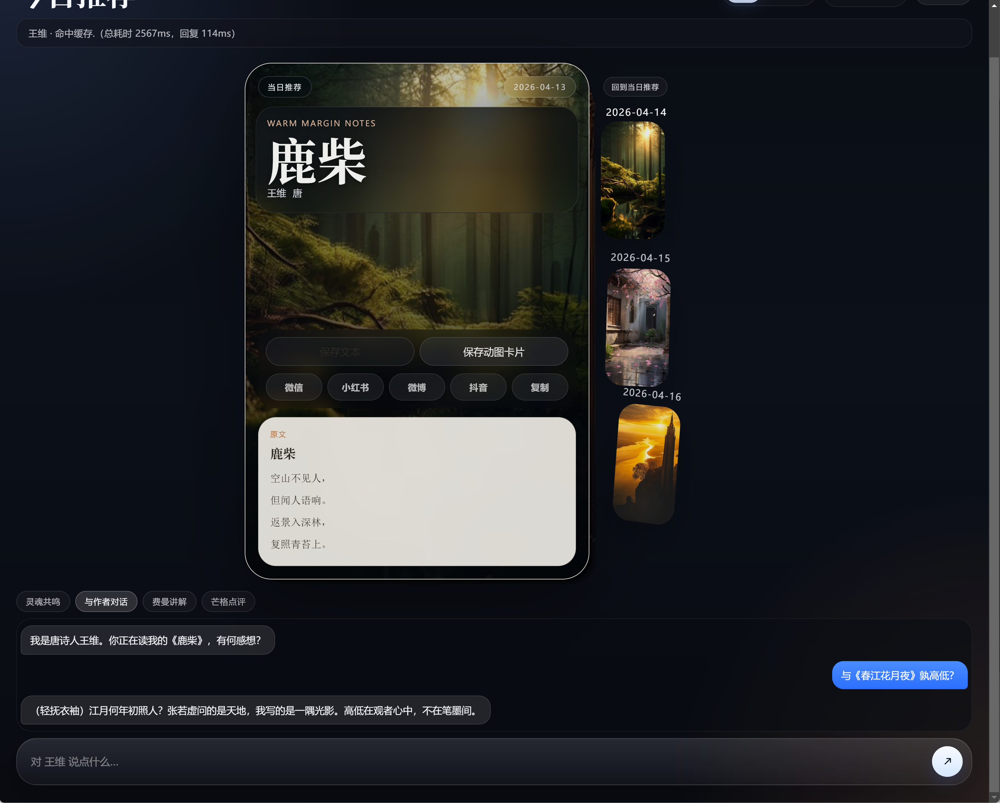
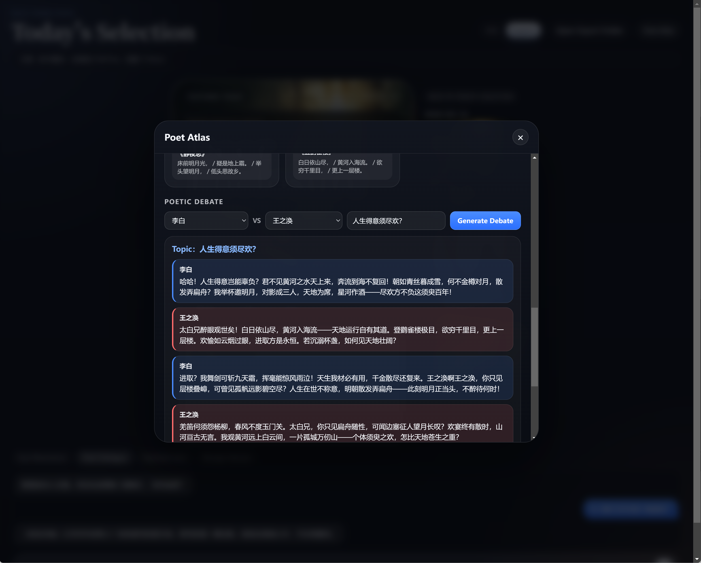
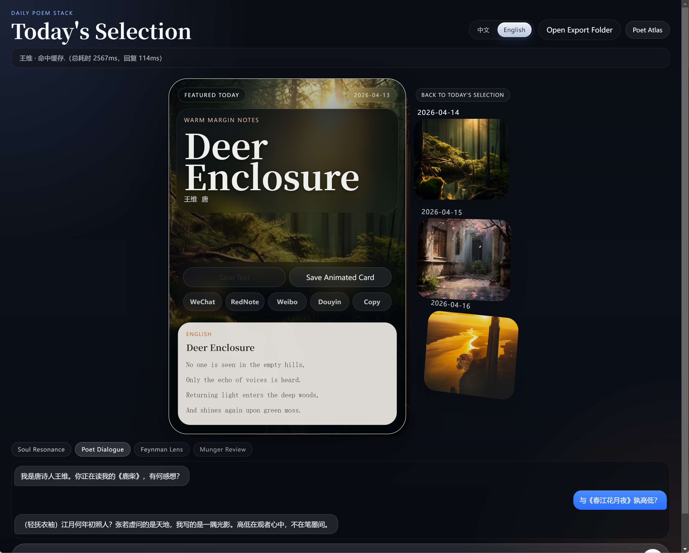

# Daily Poem Card

Language / 语言: [中文](#中文说明) | [English](#english-guide)

---

## 中文说明

### 项目气质

这不是一张静态诗卡，而是一间会在晨光与夜色之间轻轻呼吸的诗意工作室。

`Daily Poem Card` 以 Electron + React + TypeScript 为骨架，把每日诗歌、动态背景、作者人格蒸馏、评论家视角与社交分享辅助，收束进一张可以阅读、翻转、保存、导出、对话的数字卡片里。它既追求画面上的静穆，也坚持工程上的可验证、可打包、可维护。

### 核心能力

1. 每日推荐机制
   
   1. 免费模式默认展示 1 张主卡片与最多 3 张预览卡。
   2. 当前交互设计围绕“当日推荐 + 预览堆栈”展开，突出浏览节奏与卡片翻阅体验。

2. 全局中英切换
   
   1. 语言切换不只影响诗卡正文。
   2. 应用头部、底部交互栏、诗人图鉴、诗坛交锋、卡片操作、保存/分享文案、导出 HTML 都会跟随切换。

3. 多风格视觉系统
   
   1. 当前卡片会在多套视觉语言之间轮换，如 Apple 式陈列、Notion 式纸面、Raycast 式深色控制台。
   2. 诗句文字层保持静止，以保证可读性；动态只留给背景与气氛。

4. AI 能力
   
   1. 与作者对话
   2. 费曼讲解
   3. 芒格点评
   4. 诗坛交锋

5. 导出与分享
   
   1. 文本归档会追加到项目根目录的 `daily_poem_archive.md`。
   2. 动图卡片会写入 `daily_save/日期_时间_作者_标题/`，包含 HTML、视频背景、封面图与元数据。
   3. 分享链路会根据平台复制文案、复制图片，并尽量打开目标平台入口或微信草稿目录。

### 运行截图

| 主界面与作者对话 | 诗坛交锋 | 英文界面 |
|:---:|:---:|:---:|
|  |  |  |

### 技术栈

1. 桌面容器: Electron
2. 前端渲染: React 18 + TypeScript
3. 构建链路: electron-vite + Vite 5
4. 图像抓取: `html-to-image`
5. 动态背景: 运用技能agent-image-motion-skill的CLI
6. 图片来源: Brave Image Search 或 Pollinations 回退
7. 安装打包: `electron-builder` + NSIS

### 架构概览

#### 1. 进程分层

1. `src/main/`
   
   1. 负责 Electron 主进程。
   2. 管理窗口、文件写入、分享辅助、LLM 配置读取、诗歌归档与动态背景渲染调用。

2. `src/preload/`
   
   1. 提供受限桥接层。
   2. 通过 `contextIsolation` 将主进程能力以安全 API 暴露给 renderer。

3. `src/renderer/`
   
   1. 承载全部界面交互。
   2. 负责卡片渲染、翻牌、语言切换、诗人图鉴、底部 prompt bar 和交互状态展示。

4. `src/shared/`
   
   1. 存放跨进程共享的类型与纯函数。
   2. 当前已经把品牌图标、诗歌语言解析逻辑等下沉到这一层，避免 main / renderer 各写一套判断。

#### 2. 语言切换实现

语言切换不是“把诗卡换一种文本”这么简单，而是沿着一条完整的数据流贯穿全应用：

1. Renderer 维护全局 `uiLanguage`。
2. `uiCopy.ts` 负责界面文案字典。
3. `poemLanguage.ts` 负责将 `PoemRecord` 解析为当前语言版本。
4. `PoemCard.tsx` 使用 `uiLanguage` 决定界面 chrome 文案，同时用 `displayLanguage` 决定诗卡标题与正文。
5. `App.tsx` 在保存文本、导出富卡片、分享文案时，把当前语言透传给主进程。
6. 主进程据此生成与当前语言一致的 markdown、分享文案与导出 HTML。

换句话说，切换按钮触发的不是单点替换，而是一条从 UI 到导出的统一语言策略。

#### 3. 分享与导出链路

1. Renderer 捕获当前卡面为 `posterDataUrl`。
2. Main 保存 `poster.png`、`background.mp4`、`card.html` 与 `metadata.json`。
3. 分享时：
   1. 文案按当前语言生成。
   2. 图片写入剪贴板。
   3. 微信会额外生成朋友圈草稿目录，便于手动完成发布。

### 目录结构

```text
src/
  main/        Electron 主进程
  preload/     安全桥接层
  renderer/    React 界面
  shared/      跨进程共享类型与纯函数
daily_save/    动图卡片导出目录
daily_poem_archive.md
```

### 开发环境

1. Node.js 20+
2. Windows
3. 可选本地动图技能目录: `D:\YunXue\agent-image-motion-skill`

### 可选环境变量

1. `BRAVE_API_KEY`
   
   1. 启用 Brave 图片搜索。

2. `AGENT_IMAGE_MOTION_ROOT`
   
   1. 覆盖默认动态背景技能路径。
   2. 默认值为 `D:\YunXue\agent-image-motion-skill`。

### 外部诗库

1. 在项目根目录放置 `poems.library.json`，即可覆盖或补充内置诗库。
2. 数据结构可参考 `poems.library.sample.json`。

### LLM 配置

1. 首次启动时，桌面端会要求填写 LLM 配置。
2. 配置会写入运行目录旁的 `llm.config.json`。
3. 安装包不会预置这个文件，也不会把开发机上的 `llm.config.json` 打进安装产物。

### 开发命令

```bash
npm install
npm run dev
npm run build
```

### 生成 Windows 安装包

```bash
npm run dist:win
```

产物会输出到：

```text
release/
```

默认使用 NSIS 生成安装程序，配置特点如下：

1. 生成 Windows x64 安装包
2. 安装产物位于 `release/`
3. 安装包会内置 motion 渲染技能与 Node 运行时，不依赖目标机器上的外部 remotion 项目
4. `llm.config.json` 与 `llm.config.sample.json` 明确排除，不进入安装包
5. 运行时不显示额外终端窗口
   1. Electron 打包产物本身为 GUI 应用
   2. 主进程里调用动态背景 CLI 时已启用 `windowsHide: true`
6. 桌面端启动时会先做一次 motion runtime 自检
   1. 如果内置渲染链路损坏，界面会回退为静态封面
   2. 动图导出会被明确禁用，而不是直接抛出底层异常

纯净机验收清单见：

```text
docs/windows-clean-machine-checklist.md
```

### 输出文件

1. `daily_poem_archive.md`
2. `daily_save/`
3. `.daily_runtime/`
4. `release/`

### 诗词来源说明

1. 应用内置诗词库为项目内整理与维护的精选语料，用于提供可离线使用的基础阅读体验。
2. 内置中文原诗通常采用公开流传版本；英文标题、译文与说明文字则属于面向产品体验整理、改写或辅助生成的工作性文本，不应视为权威校勘本或正式出版译本。
3. 当启用扩展诗库或联网抓取时，新增内容可能来自以下来源：
   1. 用户自行提供的 `poems.library.json`
   2. 搜韵公开接口
   3. Poetry Foundation 页面抓取
   4. PoetryDB
4. 外部来源内容的版权、署名与再使用边界，仍以原作者、原译者、原出版方或原站点的规定为准；如需公开发布、再分发或商用，请自行核对授权与来源信息。
5. 本项目更适合作为诗词阅读、视觉实验与交互原型工作室，而不是权威诗歌数据库。

---

## English Guide

### The Spirit of the Project

This is not merely a static quote card. It is a small desktop atelier where poetry, motion, and dialogue gather under one pane of glass.

`Daily Poem Card` is built with Electron, React, and TypeScript. It presents a daily poem as a living card: readable, flippable, saveable, exportable, and ready to converse through distilled author personas and critic lenses. The visual tone aims for quiet elegance; the engineering underneath remains explicit, testable, and packageable.

### Core Features

1. Daily recommendation flow
   
   1. Free mode exposes one featured poem plus up to three previews.
   2. The interaction model centers on a featured daily card and a short preview stack, keeping the experience focused and calm.

2. Full application language switching
   
   1. The toggle does not stop at the poem body.
   2. The entire UI, including poem cards, controls, debate panel, save/share text, and exported HTML, follows the selected language.

3. Multi-system visual design
   
   1. Cards rotate through several art directions inspired by editorial, gallery, and command-surface aesthetics.
   2. The text layer remains static for legibility while motion lives in the background.

4. AI-assisted interactions
   
   1. Poet Dialogue
   2. Feynman Lens
   3. Munger Review
   4. Poetic Debate

5. Export and share pipeline
   
   1. Text saves append to `daily_poem_archive.md`.
   2. Rich exports are written into `daily_save/` with HTML, video, poster, and metadata.
   3. Sharing helpers prepare caption text, clipboard media, and platform-specific launch actions.

### Screenshots

| Main UI with Poet Dialogue | Poetic Debate | English UI |
|:---:|:---:|:---:|
|  |  |  |

### Tech Stack

1. Desktop shell: Electron
2. Renderer: React 18 + TypeScript
3. Build system: electron-vite + Vite 5
4. Card capture: `html-to-image`
5. Motion background generation: Using agent-image-motion-skill's CLI
6. Image sourcing: Brave Image Search with Pollinations fallback
7. Windows packaging: `electron-builder` + NSIS

### Architecture

#### 1. Process boundaries

1. `src/main/`
   
   1. Electron main process responsibilities
   2. Window creation, file output, share helpers, LLM config I/O, archive management, and motion-render subprocess orchestration

2. `src/preload/`
   
   1. Secure bridge layer
   2. Exposes a bounded desktop API under `contextIsolation`

3. `src/renderer/`
   
   1. React UI runtime
   2. Owns the card interface, flipping flow, language switching, atlas panel, prompt bar, and interactive status surface

4. `src/shared/`
   
   1. Cross-process types and pure helpers
   2. Hosts shared language-resolution logic and brand icon definitions to keep main and renderer behavior aligned

#### 2. How global language switching works

The language switch is implemented as a full data-flow decision rather than a visual afterthought:

1. Renderer stores a global `uiLanguage`.
2. `uiCopy.ts` provides application-wide interface copy.
3. `poemLanguage.ts` resolves the correct poem version for the active language.
4. `PoemCard.tsx` uses UI language for chrome text and display language for poem title/body.
5. `App.tsx` forwards the active language into save, export, and share calls.
6. Main process generates markdown, share captions, and exported HTML in the same language.

That means the selected language remains coherent from what the user sees to what the user exports.

#### 3. Export and share flow

1. Renderer captures the visible card as `posterDataUrl`.
2. Main process writes `poster.png`, `background.mp4`, `card.html`, and `metadata.json`.
3. Share helpers generate language-aware text and launch platform-specific actions.
4. For WeChat, an additional Moments draft folder is opened with `poster.png` and `caption.txt`.

### Project Layout

```text
src/
  main/
  preload/
  renderer/
  shared/
daily_save/
daily_poem_archive.md
```

### Development

```bash
npm install
npm run dev
npm run build
```

### Optional Environment Variables

1. `BRAVE_API_KEY`
2. `AGENT_IMAGE_MOTION_ROOT`

### External Poem Library

Place `poems.library.json` in the project root to extend or replace the built-in corpus. Use `poems.library.sample.json` as the schema reference.

### LLM Configuration

1. The desktop app asks for LLM configuration on first launch.
2. Runtime configuration is written to `llm.config.json` beside the app.
3. The Windows installer intentionally does not package that file.

### Building the Windows Installer

```bash
npm run dist:win
```

Output:

```text
release/
```

Installer behavior:

1. NSIS-based Windows x64 installer
2. Bundles the motion-render skill and a Node runtime, so the target machine does not need the external remotion project
3. Runtime LLM config excluded from packaged files
4. No persistent terminal window during normal app runtime
   1. The packaged Electron app is GUI-based
   2. The motion-render subprocess is already launched with `windowsHide: true`
5. Desktop startup now performs a motion runtime self-check
   1. If the bundled runtime is broken, the UI falls back to static artwork
   2. Animated export is disabled with an explicit user-facing message instead of exposing a raw runtime error

Clean-machine validation checklist:

```text
docs/windows-clean-machine-checklist.md
```

### Output Artifacts

1. `daily_poem_archive.md`
2. `daily_save/`
3. `.daily_runtime/`
4. `release/`

### Poem Source Notice

1. The built-in poem library is a curated in-project corpus maintained to provide a baseline offline reading experience.
2. Built-in Chinese source texts generally follow widely circulated public versions. The English titles, translations, and notes included in the app are editorial working texts created, adapted, or refined for the bilingual product experience, and should not be treated as authoritative scholarly editions or published translations.
3. When external expansion or network fetching is enabled, additional poems may come from the following sources:
   1. user-supplied `poems.library.json`
   2. the SouYun public API
   3. Poetry Foundation page extraction
   4. PoetryDB
4. Copyright, attribution, and permitted reuse of externally sourced material remain subject to the original authors, translators, publishers, or source sites. Verify rights and attribution before redistribution, publication, or commercial use.
5. This project is better understood as a poetry-reading, visual-experiment, and interaction studio than as an authoritative poetry database.
